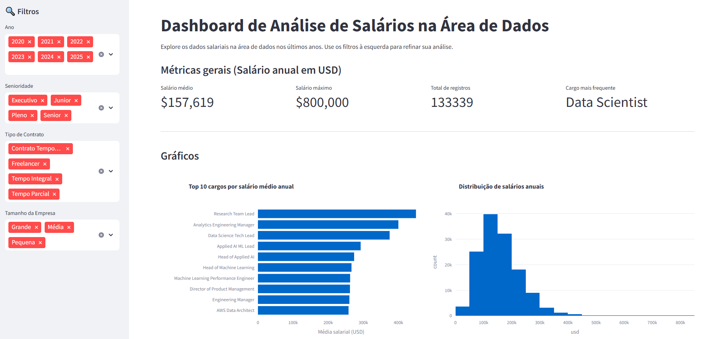
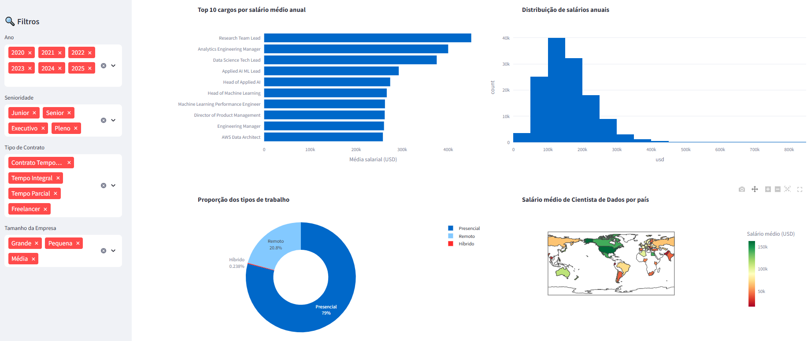
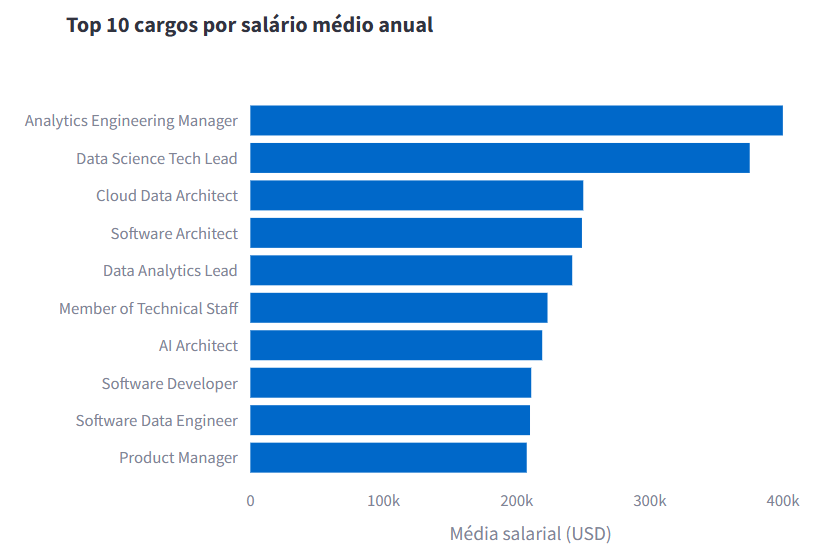
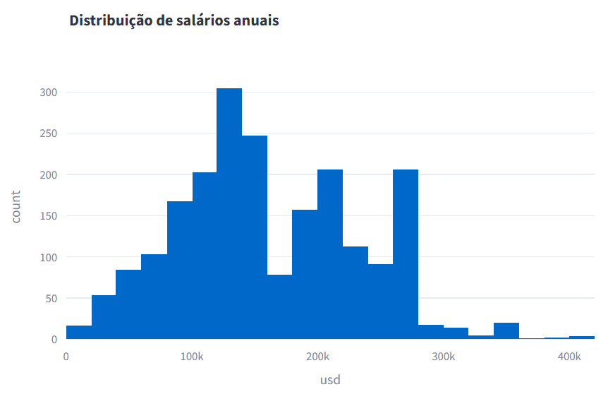
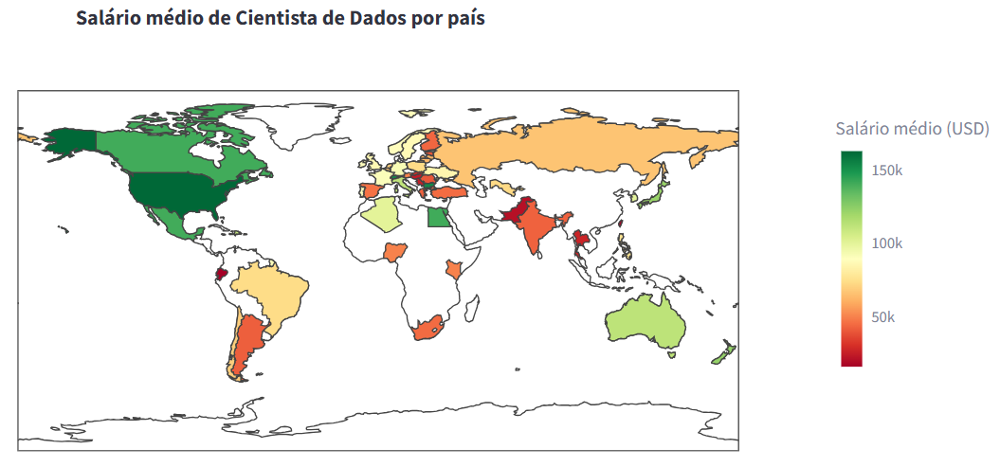
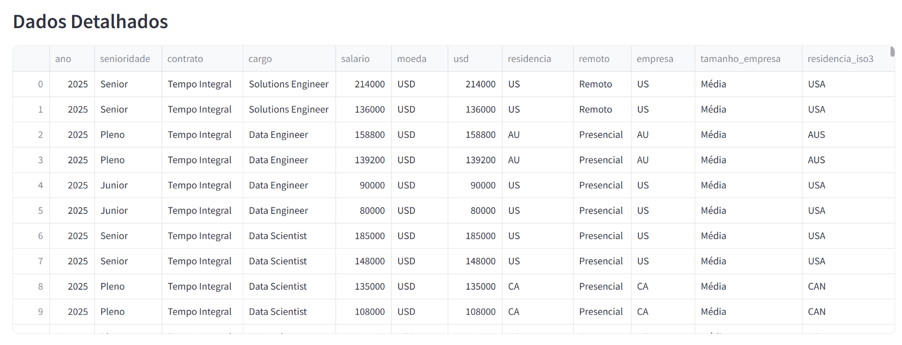

# 📊 Dashboard de Salários na Área de Dados

Este projeto é um **dashboard interativo** construído com [Streamlit](https://streamlit.io/), [Pandas](https://pandas.pydata.org/), [Plotly](https://plotly.com/python/) e [Seaborn](https://seaborn.pydata.org/).  
O objetivo é explorar e visualizar dados salariais da área de dados nos últimos anos.

---

## 🚀 Funcionalidades
- Filtros interativos por **Ano**, **Senioridade**, **Contrato** e **Tamanho da Empresa**.
- KPIs principais (salário médio, máximo, registros totais e cargo mais frequente).
- Gráficos interativos com Plotly (barras, histogramas e pizza).
- Mapa mundial mostrando o salário médio de Cientistas de Dados por país (choropleth).
- Interface amigável e responsiva com Streamlit.

---

## 📦 Pré-requisitos
Certifique-se de ter instalado:
- [Python 3.9+](https://www.python.org/downloads/)  
- [pip](https://pip.pypa.io/en/stable/installation/)  

---

## 🚀 Como acessar o Dashboard

Você tem duas opções:

### 🔹 1. Acessar online

O dashboard já está publicado no **Streamlit Cloud**.  
👉 [Acesse aqui](https://dashboard-salarios-area-ciencia-de-dados.streamlit.app/)

### 🔹 2. Instalação e execução local

1. Clone este repositório ou baixe os arquivos:
   ```bash
   git clone https://github.com/beatrizkhey/Dashboard-de-Salarios-na-Area-de-Ciencia-de-Dados.git
   cd Dashboard-de-Salarios-na-Area-de-Ciencia-de-Dados
   ```

2. Crie um ambiente virtual (venv):
   ```bash 
   python -m venv venv
   ```

3. Ative a venv:
   Windows (PowerShell):
      ```bash 
      venv\Scripts\Activate   
      ```

   Linux/macOS:
   ```bash 
   source venv/bin/activate
   ```

4. Instale as dependências:
   ```bash 
   pip install -r requirements.txt
   ```

5. Execute o dashboard com Streamlit:
   ```bash 
   streamlit run app.py
   ```

6. Abra o navegador no endereço indicado (geralmente):

   http://localhost:8501   

---

## 📊 Exemplos do Dashboard

### Visão Geral



### Top 10 Cargos por Salário Médio Anual


### Distribuição de Salários Anuais


### Proporção dos Tipos de Trabalho


### Salário Médio de Cientista de Dados por País


### Dados Detalhados


---

## 🛠️ Tecnologias Utilizadas
- [Python](https://www.python.org/)
- [Pandas](https://pandas.pydata.org/)
- [Streamlit](https://streamlit.io/)
- [Plotly](https://plotly.com/python/)
- [Seaborn](https://seaborn.pydata.org/)

---

## 👩‍💻 Autor

Desenvolvido por [Beatriz Khey](https://github.com/beatrizkhey) ✨